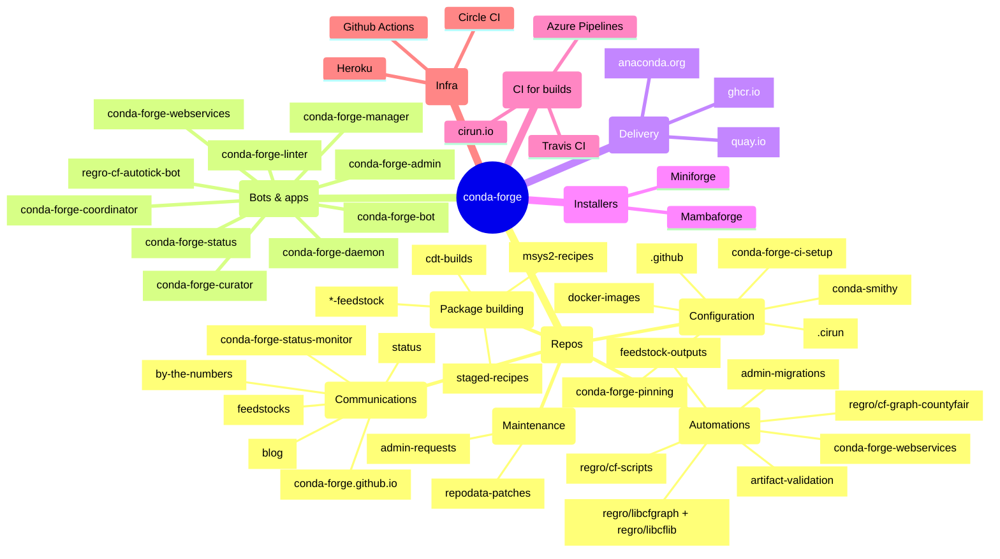

# Diagrams

:::info

Work in progress. This might not render correctly at all.
:::

```mermaid
mindmap
  root((conda-forge))
    (Repos)
        (Package building)
            [*-feedstock]
            [staged-recipes]
            [cdt-builds]
            [msys2-recipes]
        (Maintenance)
            [admin-requests]
            [repodata-patches]
        (Configuration)
            [.github]
            [.cirun]
            [conda-forge-pinning]
            [conda-forge-ci-setup]
            [docker-images]
            [conda-smithy]
        (Automations)
            [admin-migrations]
            [artifact-validation]
            [regro/cf-scripts]
            [conda-forge-webservices]
            [regro/cf-graph-countyfair]
            [regro/libcfgraph + regro/libcflib]
            [feedstock-outputs]
        (Communications)
            [conda-forge.github.io]
            [blog]
            [status]
            [by-the-numbers]
            [conda-forge-status-monitor]
            [feedstocks]
    (Bots & apps)
        [conda-forge-admin]
        [conda-forge-bot]
        [conda-forge-coordinator]
        [conda-forge-daemon]
        [conda-forge-linter]
        [conda-forge-manager]
        [conda-forge-status]
        [regro-cf-autotick-bot]
        [conda-forge-curator]
        [conda-forge-webservices]
    (Delivery)
        [anaconda.org]
        [ghcr.io]
        [quay.io]
    (Installers)
        Miniforge
        Mambaforge
    (CI for builds)
        Azure Pipelines
        Travis CI
        cirun.io
    (Infra)
        Heroku
        Github Actions
        Circle CI
```
